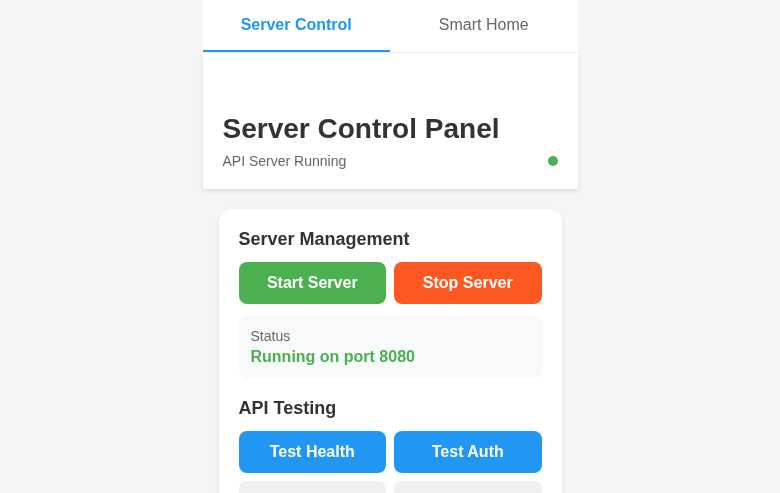

# App Screenshots

This directory contains screenshots of the Mobile API Control Pattern app interface, demonstrating the dual-interface architecture that enables both mobile UI and programmatic API control.

## Screenshots

### Smart Home Control Panel

**File:** `smart_home_tab.jpg`

The consumer-facing interface featuring:
- **Tab Navigation:** Easy switching between Smart Home and Server Control interfaces
- **Device Status:** Real-time online/offline indicators with status counts (3/3 Online • 2 Active)
- **Device Cards:** Touch-friendly controls for different device types
  - **Lighting:** Switch controls with ON/OFF states (Living Room Light: ON, Bedroom Light: OFF)
  - **Climate:** Temperature display and control (Home Thermostat: 72°F)
- **Quick Actions:** Bulk operations like "All Lights On/Off"
- **Last Updated:** Timestamps showing real-time synchronization

### Server Control Panel

**File:** `server_control_tab.jpg`

The API server management and testing interface featuring:
- **Server Management:** Start/Stop controls with status display (Running on port 8080)
- **API Testing:** Built-in test buttons for Health, Auth, Get Devices, and Toggle Light operations
- **Response Log:** Real-time API response monitoring with timestamps
- **Performance Monitor:** API call metrics including response times and call frequency
- **Visual Indicators:** Color-coded status feedback and server health indicators

## Key Features Demonstrated

1. **Dual Interface Architecture:** Seamless tab navigation between consumer and developer interfaces
2. **Real-time Synchronization:** UI state changes reflected immediately with API server updates
3. **Performance Monitoring:** Built-in metrics for API response times and call tracking
4. **Mobile-First Design:** Touch-optimized controls with clear visual feedback
5. **Developer Tools:** Comprehensive API testing and debugging capabilities

## GitHub URLs

The screenshots are also available at:
- Smart Home Tab: https://github.com/user-attachments/assets/3c536172-2524-4681-aedc-bb74d8485e10
- Server Control Tab: https://github.com/user-attachments/assets/d2272514-2e1c-42ee-abef-4e24f99cd394

These screenshots showcase the complete Mobile API Control Pattern implementation, demonstrating how a single React Native app can provide both an intuitive consumer interface and powerful programmatic control capabilities.